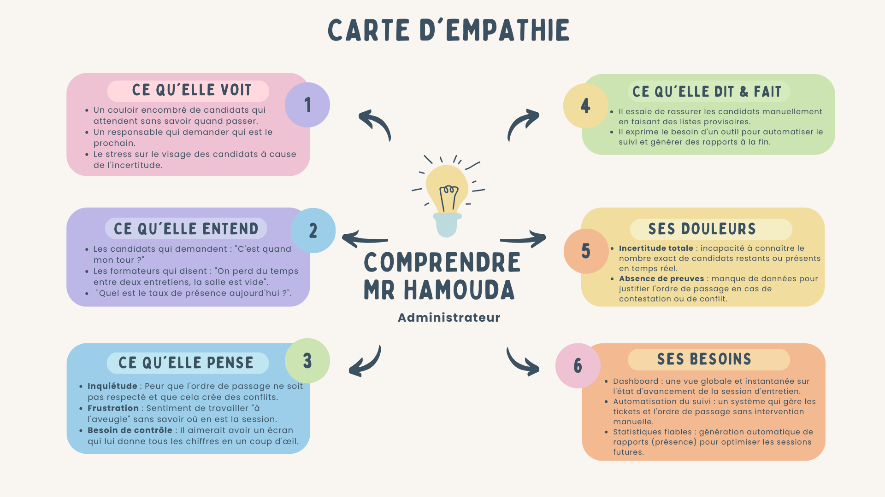
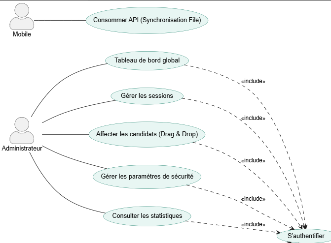
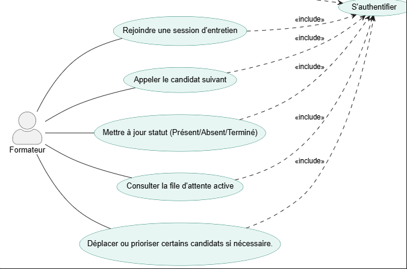
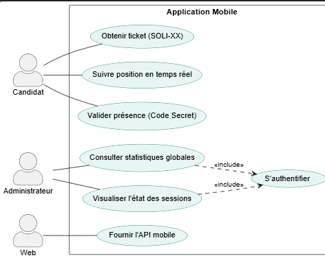

  
  

# **Projet de Fin de Formation**
### Application de gestion de files d’attente

**Réalisé par :** Yousra Akajou  
**Encadré par :** M. ESSARRAJ Fouad  
**Filière :** Développement Mobile 

---

## Sommaire

  

1

Contexte du projet

  

2

Méthodologie de travail

  

3

Branche Fonctionnelle

  

4

Branche Technique

  

5

Conception

    

6

Démonstration

  

7

Conclusion

---
## 1. Contexte du projet

---

## 2. Méthodologie : Design Thinking

  

---

## Méthodologie : Scrum (Agile)

  

---

## Méthodologie : 2TUP

  

---

## 3. Branche Fonctionnelle : Design Thinking
### 1. EMPATHIE
### Carte d'empathie Candidat

  

---
## Branche Fonctionnelle : Design Thinking
### 1. EMPATHIE
### Carte d'empathie Formateur

  

---
## Branche Fonctionnelle : Design Thinking
### 1. EMPATHIE

### Carte d'empathie Administrateur

  

---

## Branche Fonctionnelle : Design Thinking
### 2. DÉFINITION

  

    <h4>Cadrage du problème</h4>
    <blockquote style="font-style: italic; background: white; padding: 15px; border-radius: 8px;">
     
 Les candidats souffrent d'une attente opaque et stressante sans visibilité sur leur rang, tandis que l'administration peine à gérer les flux manuellement sur papier, ce qui rend le processus d'entretien désorganisé et inefficace.

      
- Comment pourrions-nous digitaliser la file d'attente pour offrir une transparence totale aux candidats et un pilotage centralisé aux organisateurs ? 

    </blockquote>
  

---

## Branche Fonctionnelle : Cas d'utilisation
### Diagramme cas d'utilisation global: Partie Public

  

---

## Branche Fonctionnelle : Cas d'utilisation
### Diagramme cas d'utilisation global: Partie Admin
### Espace Admin

  

---

## Branche Fonctionnelle : Cas d'utilisation
### Diagramme cas d'utilisation global: Partie Admin
### Espace Formateur

  

---

## Branche Fonctionnelle : Cas d'utilisation
### Diagramme cas d'utilisation global: Mobile
### Espace Formateur

  

---

## Branche Fonctionnelle : Cas d'utilisation - Sprint 1

  

---

## Branche Fonctionnelle : Cas d'utilisation - Sprint 2

  

---
## Branche Fonctionnelle : Maquette web

  

    
    
Interface Administration

  

---

## Branche Fonctionnelle : Maquette mobile

  

    
    
Interface Mobile

  

---

## 4. Branche Technique : Tech Stack

  

    <h4>Backend</h4>
    <ul>
      <li><strong>Framework :</strong> Laravel 12</li>
      <li><strong>Base de données :</strong> MySQL</li>
      <li><strong>Architecture :</strong> MVC / N-Tiers</li>
    </ul>
  

  

    <h4>Frontend</h4>
    <ul>
      <li><strong>Preline</strong></li>
      <li><strong>Alpine.js</strong></li>
      <li><strong>AJAX</strong></li>
    </ul>
  

---

## 5. Conception : Diagramme de classe

 <h3>Modélisation des données</h3>

 
  

---

## 6. Conclusion

### Merci pour votre attention !