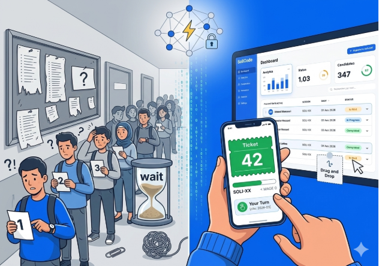
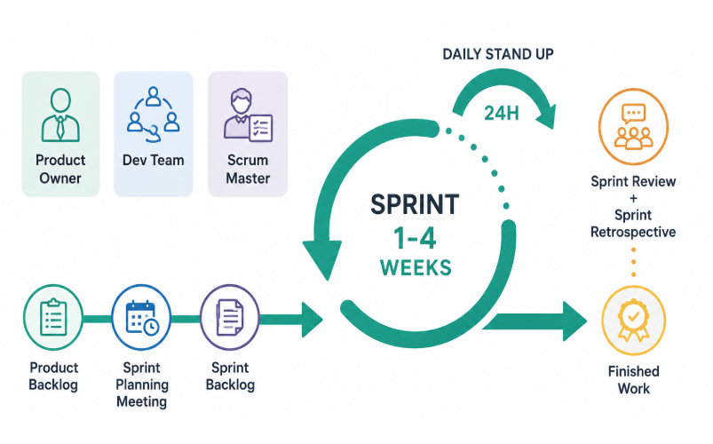
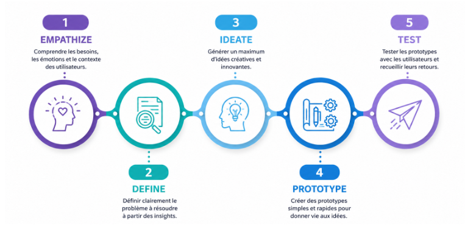
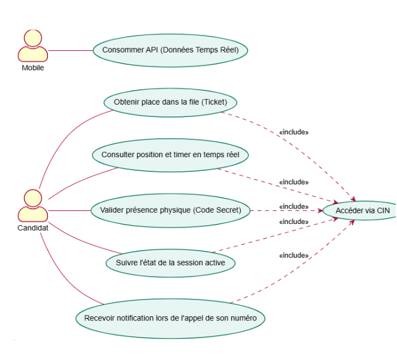
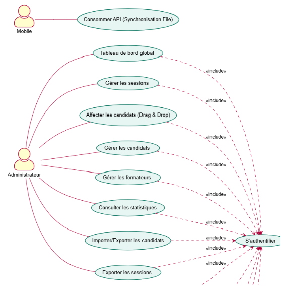
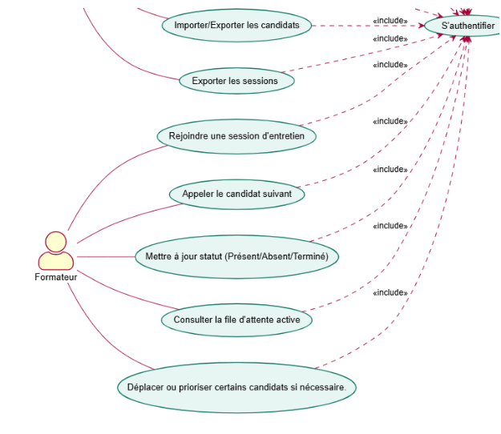
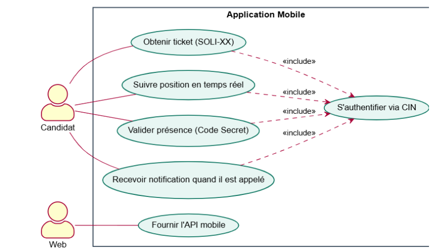

# Rapport de Projet  
## Application de Gestion de Files d’Attente (SoliQueue)

**Réalisé par :** Youssra Akajou  
**Encadré par :** Monsieur ESSARRAJ Fouad  
**Date :** Juin 2026  

---

## Table des matières

- [Liste des figures](#liste-des-figures)
- [Remerciement](#remerciement)
- [Introduction](#introduction)
- [Contexte de projet](#contexte-de-projet)
- [Cahier de charge](#cahier-de-charge)
- [Méthode de travail](#méthode-de-travail)
- [Branche fonctionnelle](#branche-fonctionnelle)
- [Branche technique](#branche-technique)
- [Conception](#conception)
- [Réalisation](#réalisation)
- [Conclusion](#conclusion)

---

## Liste des figures

**Figure 1 :** Contexte de projet  
**Figure 2 :** Méthode Scrum  
**Figure 3 :** Méthode 2TUP  
**Figure 4 :** Design thinking  
**Figure 5 :** Carte d’empathie de candidat  
**Figure 6 :** Carte d’empathie de formateur  
**Figure 7 :** Carte d’empathie d’Administrateur  
**Figure 8 à 16 :** Diagrammes de cas d’utilisation  
**Figure 18 :** Architecture globale de projet  
**Figure 19 :** Diagramme de classes  
**Figure 20 :** Charte graphique  
**Figure 21 à 24 :** Maquettes  
**Figure 24 à 33 :** Interfaces Web Sprint 1

---

## Remerciement

Je tiens à exprimer ma profonde gratitude à Monsieur **ESSARRAJ Fouad** pour avoir encadré ce projet de fin d'études avec autant d'implication. Ses orientations précieuses, sa grande réactivité et la rigueur de son suivi ont été des piliers essentiels pour mener à bien ce travail et enrichir mes compétences professionnelles.

Je le remercie chaleureusement pour sa bienveillance, ses critiques toujours constructives et ses encouragements constants.

Mes remerciements s'adressent également au corps professoral et à l'équipe pédagogique pour l'excellence de leur enseignement.

Enfin, je témoigne toute ma reconnaissance à mes proches pour leur soutien moral.

---

## Introduction

La gestion des flux et de l'attente lors des sessions d'entretiens constitue une étape logistique essentielle au sein d'un établissement de formation comme **SoliCode**. 

Cependant, l’organisation de ces passages se heurte souvent à des difficultés majeures : absence de visibilité sur l’ordre de passage, stress lié à une attente imprévisible et coordination complexe pour les équipes pédagogiques.

Le projet **SoliQueue** vise à digitaliser et centraliser la gestion des files d’attente, transformant cette attente physique en une expérience numérique transparente et efficace.

---

## Contexte de projet

Dans le cadre de ma formation en développement web, j’ai constaté que la gestion des flux de candidats après la réussite du QCM était particulièrement laborieuse (listes papier, appels oraux dispersés). 

Cela entraînait une perte de temps considérable et une incertitude constante pour les étudiants. 

**SoliQueue** est né de ce constat pour moderniser ce processus.

---

## Cahier de charge

**SoliQueue** est une solution hybride (Web/Mobile) permettant d’automatiser la file d’attente des entretiens.

### Objectifs principaux :
- Digitaliser le ticket de passage (ex: SOLI-88)
- Validation de présence par code secret à 4 chiffres
- Appel en « un-clic » pour les formateurs
- Statistiques de présence et durée d’entretien

### Utilisateurs et rôles :
- **Candidat** : Suit son rang et timer
- **Formateur** : Gère l’appel des candidats
- **Administrateur** : Configure les sessions et analyse les données

---

## Méthode de travail

### Scrum

### 2TUP

### Design Thinking

---

## Branche fonctionnelle

### Cartes d’empathie

**Figure 5 :** Carte d’empathie de candidat  

**Figure 6 :** Carte d’empathie de formateur  

**Figure 7 :** Carte d’empathie d’Administrateur  

### Définition de problème & Idéation
- Malgré l’importance des sessions d’évaluation et des entretiens, leur gestion reste difficile en raison de l’opacité des files d’attente physiques, du manque de suivi en temps réel et de l’absence d’une plateforme centralisée. Les candidats souffrent d'une attente aveugle et stressante dans les couloirs, les formateurs perdent un temps précieux à gérer manuellement les flux et l'appel des numéros, et les administrateurs manquent d’une vue globale pour superviser efficacement l'état d'avancement des sessions. 
    ### How Might We ?
- Comment pourrions-nous concevoir une plateforme centralisée permettant aux candidats de suivre facilement leur position, aux formateurs de gérer l'appel et les statuts de manière fluide, et aux administrateurs de superviser l’ensemble du processus de manière simple et sécurisée ? 

### Diagrammes de cas d’utilisation globale : Web

- ### Espace Public

  
 
 - ### Espace Admin

 

 - ### Espace Formateur

 

### Diagrammes de cas d’utilisation globale : Application Mobile
 

---

## Branche technique

### Choix technologiques
- **Backend** : PHP 8+ / Laravel
- **Frontend** : Tailwind CSS, Alpine.js, Blade
- **Base de données** : MySQL
- **Mobile** : NativePHP
- **Autres** : Spatie Permission, Sanctum, Vite

**Figure 18 : Architecture globale**  

---

## Conception

**Figure 19 : Diagramme de classes**  

**Figure 20 : Charte graphique**  

### Maquettes

**Figure 21 :** Maquette Tableau de bord admin  
**Figure 22 :** Maquette Interface candidat  
**Figure 23 :** Maquette Interface formateur  
**Figure 24 :** Maquettes Mobile

---

## Réalisation

### Interfaces Web Sprint 1

---

## Conclusion

Ce projet de fin d’études a permis de concevoir et développer **SoliQueue**, une application web et mobile dédiée à la digitalisation des files d’attente d’entretiens. 

Cette solution facilite le suivi pour les candidats, simplifie la gestion pour les formateurs et offre des outils d’analyse à l’administrateur.

---

**Merci pour votre attention !**