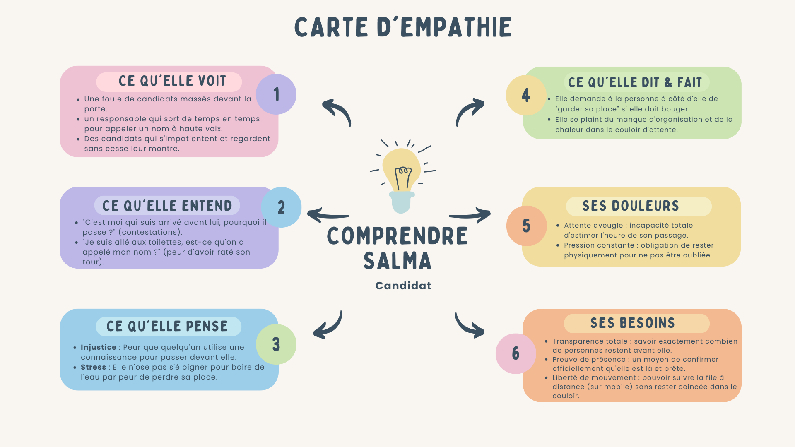
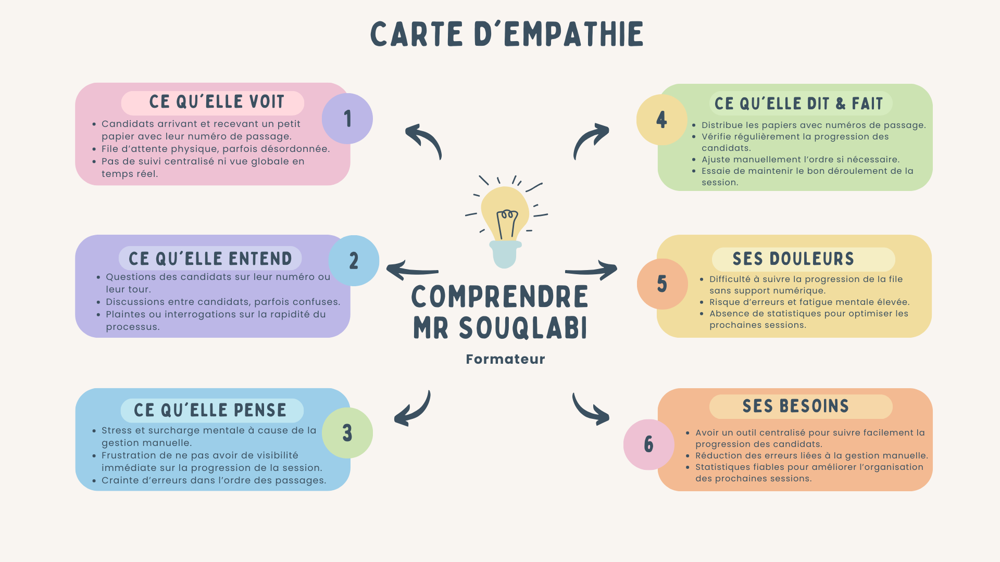
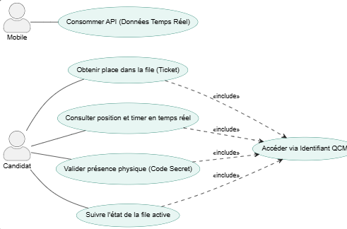
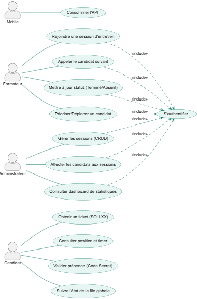
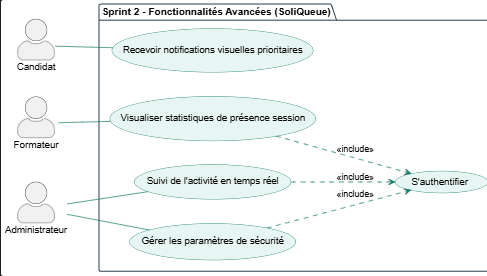
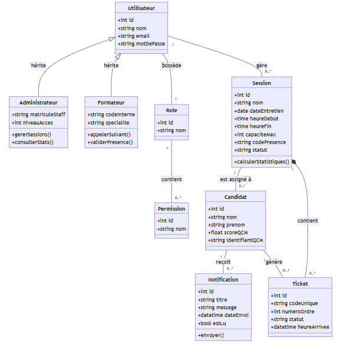
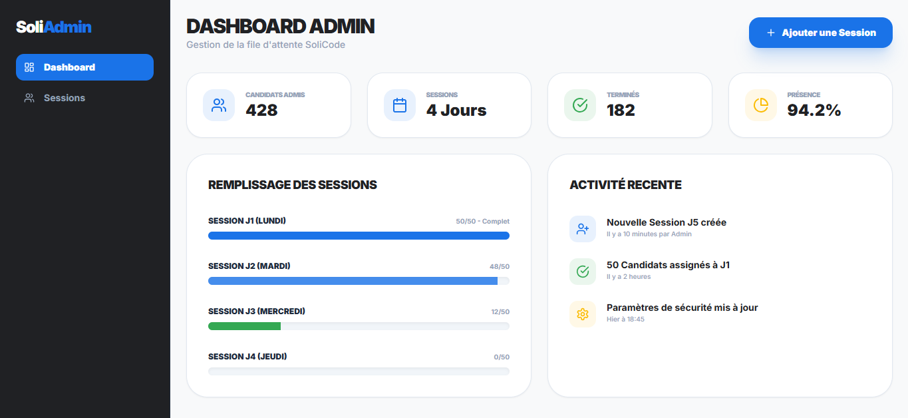
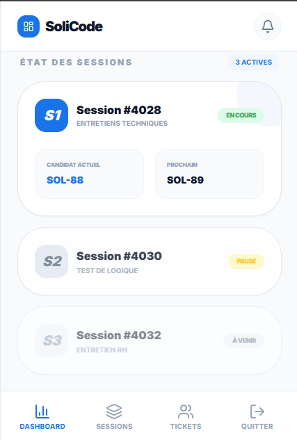

# Rapport de Projet de Fin de Formation  
## Application de gestion de files d’attente  
### Formation de Développement Mobile – Mode Bootcamp  

---

**Réalisée par :** Yousra Akajou  
**Encadré par :** Mr. Essarraj Fouad  

**Année de Formation :** 2025/2026  

---

# Table des matières

1. [Liste des figures](#liste-des-figures)  
2. [Remerciement](#remerciement)  
3. [Introduction](#introduction)  
4. [Contexte de projet](#contexte-de-projet)  
5. [Objectif de Project](#objectif-de-project)  
6. [Cahier de charge](#cahier-de-charge)  
7. [Méthode de travail](#méthode-de-travail)  
8. [Scrum](#scrum)  
9. [La méthodologie 2TUP](#la-méthodologie-2tup)  
10. [Design Thinking](#design-thinking)  
11. [Branche fonctionnelle](#branche-fonctionnelle)  
12. [Carte d’empathie](#carte-dempathie)  
13. [Définition de problème](#définition-de-problème)  
14. [Diagramme de cas d’utilisation générale](#diagramme-de-cas-dutilisation-générale)  
15. [Diagramme de cas d’utilisation Sprint 1](#diagramme-de-cas-dutilisation-sprint-1)  
16. [Diagramme de cas d’utilisation Sprint 2](#diagramme-de-cas-dutilisation-sprint-2)  
17. [Branche technique](#branche-technique)  
18. [Choix technologiques](#choix-technologiques)  
19. [Architecture de projet](#architecture-de-projet)  
20. [Prototype (Fonctionnalités, Classes)](#prototype-fonctionnalités-classes)  
21. [Conception](#conception)  
22. [Diagramme de classe](#diagramme-de-classe)  
23. [Maquettes](#maquettes)  
24. [Charte graphique](#charte-graphique)  
25. [Réalisation](#réalisation)  
26. [Interfaces](#interfaces)  
27. [Conclusion](#conclusion)  

---

# Introduction

Dans le cadre de la digitalisation des processus administratifs à SoliCode, la gestion des entretiens de recrutement représente un défi logistique majeur. Actuellement, l'absence de système automatisé pour gérer l'ordre de passage des candidats crée une attente opaque, génératrice de stress pour les étudiants et de désorganisation pour l'administration. Le projet SoliQueue a été conçu pour répondre à ce besoin en transformant une file d'attente physique invisible en une expérience numérique transparente, permettant un suivi en temps réel pour toutes les parties prenantes. 

---

# Contexte de projet

Lors de ma formation en développement web à SoliCode, j’ai observé que la gestion manuelle des flux de candidats après la réussite de leur QCM reposait sur des listes papier ou des appels oraux dispersés. Ce manque de structure entraîne une perte de temps considérable et une incertitude constante pour les candidats. SoliQueue naît de la volonté de moderniser ce parcours en offrant un ticket numérique unique et un monitoring centralisé pour les formateurs et les administrateurs.

---

# Objectif de Project

*(À compléter)*  

---

# Cahier de charge

## Description :

SoliQueue est une solution hybride (Web/Mobile) permettant d'automatiser la file d'attente des entretiens. Elle assure la transition fluide du candidat du statut "Admis au QCM" vers l'entretien final.

## Objectifs principaux
- Digitaliser le ticket de passage : Attribution automatique d'un rang (ex: SOLI-88).

- Assurer la présence physique : Validation par un code secret à 4 chiffres.

- Optimiser le pilotage : Offrir aux formateurs un outil d'appel "un-clic".

- Analyser les flux : Générer des statistiques de présence et de durée d'entretien.

## Utilisateurs et rôles
- Candidat : Accède à son rang, suit son timer et valide sa présence sur mobile.

- Formateur : Gère l'appel des candidats et met à jour les statuts de la session.

- Administrateur : Configure les sessions, affecte les candidats (Drag & Drop) et analyse les données.

---

# Méthode de travail

---

# Scrum

La méthodologie Scrum est une méthodologie agile qui permet de gérer un projet de manière flexible et collaborative, en favorisant la livraison progressive de fonctionnalités. Elle repose sur l’itération, la priorisation des tâches et la communication régulière entre les membres de l’équipe.

Dans le cadre de ce projet, nous avons organisé le travail selon les principes de Scrum, ce qui nous a permis de mieux planifier, suivre et livrer les différentes fonctionnalités du blog de manière efficace. 

## Principes clés

- **Transparence :** Toutes les tâches et objectifs sont visibles par l’équipe.  
- **Inspection :** Chaque sprint est évalué pour détecter les améliorations possibles.  
- **Adaptation :** L’équipe ajuste le plan de travail selon les résultats des sprints précédents.  

---

# Design Thinking

 

## Qu’est-ce que le Design Thinking ?
Le **Design Thinking** est une approche de résolution de problèmes centrée sur l’humain.
Elle vise à comprendre les besoins réels des utilisateurs pour créer des solutions innovantes.
Très utilisée dans le design, la technologie, l’éducation, l’innovation et les services.
## Pourquoi utiliser le Design Thinking ?
- Encourage la créativité et l’innovation
- Permet de développer des solutions réellement adaptées aux besoins des utilisateurs
- Favorise la collaboration entre équipes
- Utile pour résoudre des problèmes complexes ou mal définis
## Les 5 étapes du Design Thinking
1. **Empathie (Empathize)**:
Comprendre l’utilisateur : observer, interviewer, analyser
Objectif : découvrir ses besoins, ses motivations et ses difficultés
2. **Définition du problème (Define)**:
Regrouper et analyser les informations collectées
Formuler un problème clair et centré sur l’utilisateur
Exemple : « Comment pourrions-nous aider l’utilisateur à… ? »
3. **Idéation (Ideate)**:
-Générer un maximum d’idées sans jugement
-Utiliser des techniques comme le brainstorming, le mind mapping, ou les questions « Comment pourrions-nous ? »
-Encourager la créativité et les points de vue variés
4. **Prototype**:
- Créer des versions simplifiées ou maquettes des idées sélectionnées
- Peut être un dessin, un modèle, une interface simple, un scénario, etc.
- Objectif : expérimenter rapidement
5. **Test**:
- Tester les prototypes auprès des utilisateurs
- Recueillir leurs commentaires
- Améliorer, ajuster ou repenser la solution

---

# Branche fonctionnelle

## Carte d'empathie
- **Apprenant Hammouda**

- **Administrateur Salma**

 

- **Formateur Souqlabi**

 
---

# Définition de problème

Les candidats manquent de visibilité sur leur ordre de passage, ce qui génère de l'incertitude. Parallèlement, l'administration manque d'outils automatisés pour piloter les sessions, rendant le suivi des présences opaque et inefficace.

**How Might We : Comment pourrions-nous digitaliser la file d'attente pour offrir une transparence totale aux candidats et un pilotage centralisé aux organisateurs ?** 

---

# Diagramme de cas d’utilisation générale

Le diagramme de cas d’utilisation global de notre application de gestion des files d’attente présente les principales fonctionnalités accessibles aux différents acteurs du système : candidat, Formateur et administrateur. Il illustre les interactions entre ces acteurs et l’application, notamment la prise de ticket, la gestion des sessions, la mise à jour des statuts et la consultation des statistiques.

- Espace Admin

- Espace public

---

# Diagramme de cas d’utilisation Sprint 1

- Focus sur le cœur du système : Attribution du ticket, suivi de position et gestion de l'appel par le formateur. 

---

# Diagramme de cas d’utilisation Sprint 2

- Focus sur l'intelligence du système : Notifications prioritaires, monitoring live de toutes les sessions et statistiques avancées.

---

# Diagramme de classe

- La structure s'appuie sur un héritage fort où Administrateur et Formateur partagent la base Utilisateur, tandis que le Candidat est lié de manière dynamique à une Session via un Ticket unique. 

---

# Maquettes

- Maquette web
  
- Maquette Mobile
  

---

# Conclusion

SoliQueue n'est pas seulement un outil de gestion, c'est un levier de confort pour l'apprenant et d'efficacité pour l'institution. En remplaçant le papier par des algorithmes de file d'attente et une validation par code secret, nous garantissons l'équité et la fluidité des entretiens de sélection à SoliCode. 